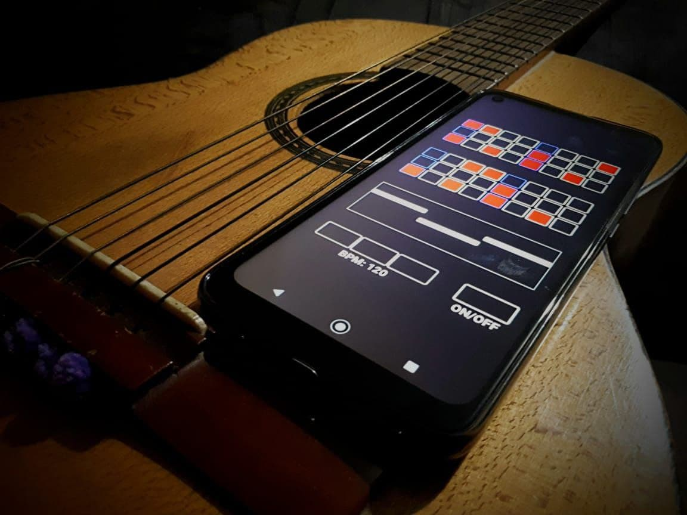
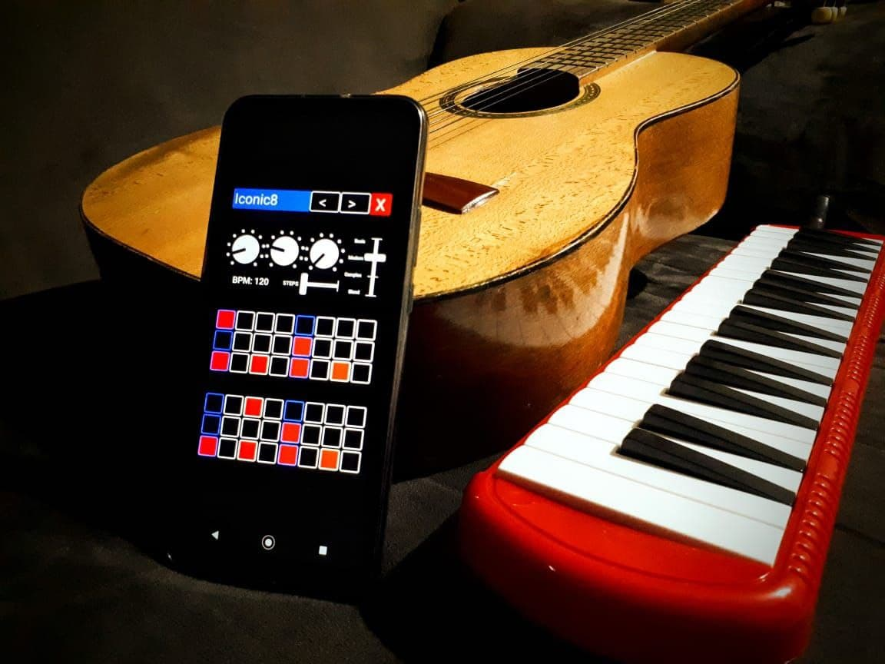
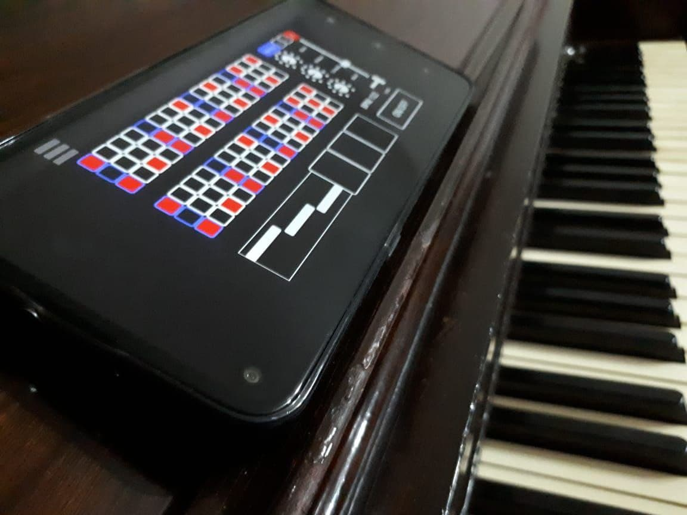

# BONFIRE DRUM SEQUENCER

> Make some marshmallows, grab your guitar and sing a song with a smooth beat around the bonfire.

Play a song with a simple rhythm track! BONFIRE is a simple drum sequencer built to play along with you. BONFIRE is great for playing acoustic and unplugged covers. It works on Mac, PC, Linux, iPhone, iPad, Android & Samsung.

## [DOWNLAOD FOR SMARTPHONE OR COMPUTER](https://alex-esc.github.io/bonfire/download) 

*free of charge!*

## Play on the go

BONFIRE runs on a computer, smartphone or tablet. Take the beat with you to your next road trip.

## Built in rhythms

BONFIRE was designed to help you play songs quickly on the spot. *hey, do you know the girl from Ipanema?* just pull up the bossa nova preset and get going. 

Includes 18 presets and you can modify them or program your own patterns.

## Made for live performance

Add drum fills and trigger them on the spot, bring in the hi-hats on the verse and bring it back on the chorus and use different drum kits on different songs.

BONFIRE allows you to sequence a pattern or play it live with built in pads, add variation to a 16 step pattern with a toggle-able 32 step mode and 3 different drum sounds: Basic drum machine sounds, classic 80´s style drums and a realistic acoustic drum kit.

## Customizable and modular at heart

Add your own drum patterns, custom features or change the layout thanks to some awesome open source magic.

BONFIRE was built on a free and open source synthesis and programming engine called Pure Data. This allows you to open the code and modify it to your liking.

# How to install BONFIRE

Head over to the [downloads page](https://alex-esc.github.io/bonfire/download).

## Why I made BONFIRE:

On early 2019 I got an upright piano and have been learning to play keyboard ever since. Music has become an important part of my life and I love sharing the joy of music with my friends and family. And at summer break of that same year me and my friends went camping and some of them brought their acoustic guitars. Singing along my pals around the BONFIRE became one of my fondest memories.

It was such a shame that I cant bring my piano with me to perform with everyone else that day. If only I had a small instrument that I can always take with me just in case my friends break into a song!

So I decided to buy a melodica! Oh, and also to make a drum machine for my phone. That was cool too.

## Get your own custom made instrument!

Get in contact with me if you're interested in getting you (or your band) custom made instruments!

Email: alexesc at disroot dot org
